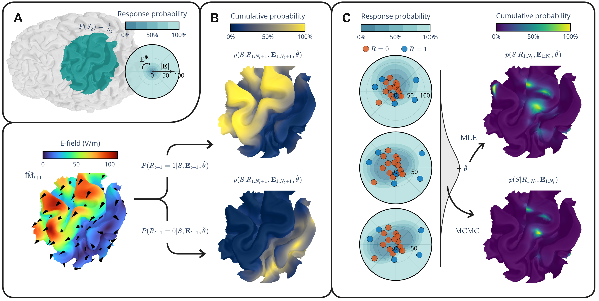
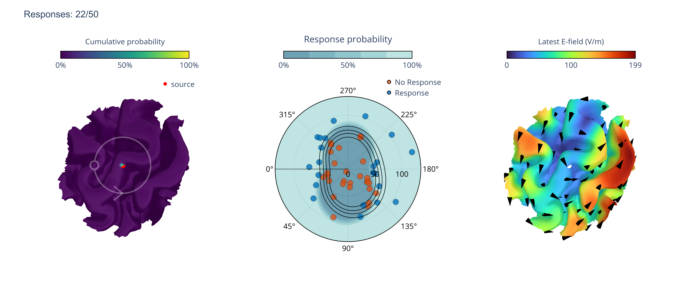

# ABL: Adaptive Bayesian Localization

[](https://doi.org/10.5281/zenodo.20441812)


*Bayesian localization of cortical sources of brain activity from binary responses to external stimulation.*



> **Figure.** A. The model is initialized, specifying the search space and initial model parameters. B. Each stimulus trial pairs a delivered E-field with a binary response. Each stimulus can be optimized to sharpen that posterior C. The per-trial response probability over the cortex accumulates into a posterior over source location. The final result is refined with full MCMC inference.

-----

## Overview
ABL estimates a posterior distribution over the cortical source of a measured response, given a sequence of stimulation trials. Each trial is a pair: an E-field delivered to the cortex, and a binary outcome (response / no response). After every new trial, the posterior over candidate source vertices is updated.

The package supports two modes:

  * **Adaptive real-time** — the next stimulus is chosen to maximize expected information gain about the source. Posterior updates run in the loop (fast MLE).
  * **Offline** — analyze a complete batch of pre-recorded (E-field, response) trials with full MCMC inference.

Under the hood, ABL fits a response model, and picks stimuli with JAX-native Differential Evolution from [evosax](https://github.com/RobertTLange/evosax) subject to stimulator hardware constraints.

## Key features

  * Adaptive stimulus selection that maximizes expected information gain.
  * In-loop posterior updates (MLE) during a session and full [NumPyro](https://num.pyro.ai/) MCMC posteriors offline.
  * Multi-coil stimulator support with hardware constraints loaded from JSON.
  * Interactive Plotly/Dash visualization running in a separate process.
  * Optional CUDA acceleration via [PyTorch](https://pytorch.org/) and JAX.

## Getting started

### Prerequisites

  * **Python 3.11 or higher**
  * **(Optional)** An NVIDIA GPU with CUDA 12-compatible drivers for acceleration. ABL falls back to CPU automatically.

#### System requirements

| Resource | Minimum                          |
| :------- | :------------------------------- |
| OS       | Ubuntu, Windows 10/11            |
| RAM      | 4 GB                             |
| VRAM     | 2 GB (only if using GPU)         |

### Installation

This project uses [Poetry](https://python-poetry.org/) to manage dependencies.

```bash
git clone git@github.com:lainem11/bayesian_localization.git
cd bayesian_localization
poetry install
```

To activate the environment afterwards, run `poetry env activate`.

## Quickstart

Both modes are built around the single public entry point, `LocalizationSession`.

### Adaptive real-time loop

```python
from ABL import LocalizationSession, preprocessing

E, _, cortex = preprocessing.load_example_model("examples/saved/example_subject/example_model.pkl")
stimulator = preprocessing.get_stimulator_from_file(
    "examples/coils/5coil_example.json", constraint_type="5coil_strain",
)

S = LocalizationSession(cortex=cortex, save_path="my_session",
                        stimulator=stimulator, efield_set=E)
S.generate_source([2679])  # simulate a known source

for _ in range(50):
    S.start_trial()
    didt = S.choose_next_stimulus()
    S.record_efield_trial(didt)
    S.simulate_response()       # or: S.record_response_trial(response) from hardware
    S.localize()                # fast in-loop MLE update
    S.complete_trial()

S.localize(full=True)           # final refinement with MCMC
S.end_session()
```

### Offline analysis of recorded trials

```python
from ABL import LocalizationSession, preprocessing

_, _, cortex = preprocessing.load_example_model(
    "examples/saved/example_subject/example_model.pkl")
efield_trials, responses = preprocessing.load_example_trials(
    "examples/saved/example_subject/example_efield_trials_and_responses.pkl")

S = LocalizationSession(cortex=cortex, save_path="offline_run")
S.import_trial_data(efield_trials, responses)
S.localize(full=True)
S.end_session()
```

## Example output



> **Figure.** Result after 50 adaptive trials. Left: cumulative source probability over the cortex with the simulated source marked. Middle: trial responses on a polar plot of E-field magnitude × direction. Right: the latest E-field magnitude with direction arrows.

## Examples

Three notebooks under [examples/](examples/) demonstrate the full workflow:

  * [examples/adaptive_protocol.ipynb](examples/adaptive_protocol.ipynb) — end-to-end adaptive run with a multi-coil stimulator and a simulated source.
  * [examples/inference_from_imported_data.ipynb](examples/inference_from_imported_data.ipynb) — offline analysis of pre-recorded trials.
  * [examples/load_recorded_session.ipynb](examples/load_recorded_session.ipynb) — small utility for reloading a previously saved session and re-rendering its visualization.

## How it works

  * The cortex is represented as a triangular mesh; an optional ROI restricts the set of candidate source vertices.
  * Per-vertex E-fields are reduced from 3D to a 2D subspace via PCA for simpler parametrization.
  * The response model is a modified sigmoid in E-field magnitude with angular modulation via a small set of Fourier components.
  * The posterior over source location is the per-vertex likelihood of all observed responses given the fitted model.
  * During a real-time session, the next stimulus is chosen by Differential Evolution to maximize expected information gain about the source, subject to stimulator constraints (for example, multi-coil current-slope limits).

## Data requirements

Helper functions in `ABL.preprocessing` cover data formatting from an example dataset.

| Mode        | Data                    | Format         | Shape                                | Description                                                          |
| :---------- | :---------------------- | :------------- | :----------------------------------- | :------------------------------------------------------------------- |
| **Real-time** | E-field set           | [PyTorch](https://pytorch.org/) tensor | `(num_coils, num_vertices, 3)`       | E-field vector field for each coil of the stimulator.                |
| **Real-time** | Stimulator config     | JSON           | n/a                                  | Stimulator properties such as `max_current_slope` and constraints.   |
| **Offline**   | Recorded E-fields     | [PyTorch](https://pytorch.org/) tensor | `(num_trials, num_vertices, 3)`      | E-field actually delivered on each trial.                            |
| **Offline**   | Recorded responses    | [PyTorch](https://pytorch.org/) tensor | `(num_trials,)`                      | Binary outcome per trial (1 = response, 0 = no response).            |

## Project layout

```
src/ABL/        package source (core, model, optimizer, efield, mesh, plotting, preprocessing, …)
examples/       Jupyter notebooks, stimulator/coil configs, and bundled example data
images/         figures used in this README
```

## Citation

If you use ABL in academic work, please cite it via the Zenodo archive ([10.5281/zenodo.20441813](https://doi.org/10.5281/zenodo.20441813)):

```bibtex
@software{laine2026abl,
  author  = {Laine, Mikael},
  title   = {{ABL: Adaptive Bayesian Localization}},
  year    = {2026},
  version = {1.0.0},
  doi     = {10.5281/zenodo.20441813},
  url     = {https://doi.org/10.5281/zenodo.20441813}
}
```

A reference publication is in preparation — please check back for an updated citation.

## License

GPL-3.0-or-later — see [LICENSE](LICENSE).

-----
